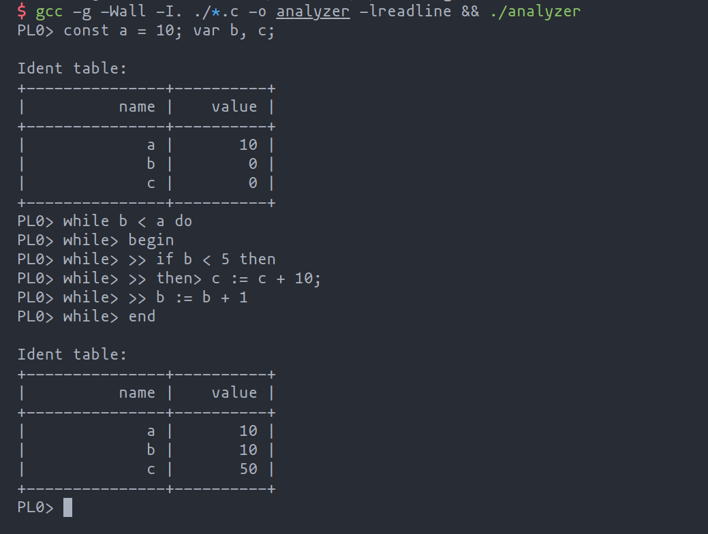

# PL0-Analyzer

一个简单的 PL/0 解释器

词法分析截止到[6a988d2](https://github.com/jason23347/PL0-Analyzer/tree/6a988d2)
语法分析截止到[a439d0b](https://github.com/jason23347/PL0-Analyzer/tree/a439d0b)



## Grammar
```
program = block "." .

block = [ "const" ident "=" number {"," ident "=" number} ";"]
        [ "var" ident {"," ident} ";"]
        { "procedure" ident ";" block ";" } statement .

statement = [ ident ":=" expression | "call" ident
              | "?" ident | "!" expression
              | "begin" statement {";" statement } "end"
              | "if" condition "then" statement
              | "while" condition "do" statement ].

condition = "odd" expression |
            expression ("="|"#"|"<"|"<="|">"|">=") expression .

expression = [ "+"|"-"] term { ("+"|"-") term}.

term = factor {("*"|"/") factor}.

factor = ident | number | "(" expression ")".
```

## Example
```pascal
const max = 100;
var arg, ret;

procedure isprime;
var i;
begin
	ret := 1;
	i := 2;
	while i < arg do
	begin
		if arg / i * i = arg then
		begin
			ret := 0;
			i := arg
		end;
		i := i + 1
	end
end;

procedure primes;
begin
	arg := 2;
	while arg < max do
	begin
		call isprime;
		if ret = 1 then write(arg);
		arg := arg + 1
	end
end;

call primes
.
```

## Dependencies

### readline
e.g. for Ubuntu
```bash
apt install libreadline-dev
```

## Build

### GCC
```bash
gcc -I. ./*.c -o analyzer -lreadline
```

### Mingw
Mingw build will be considered in future.

## Usage
CLI mode:
```bash
./analyzer
```

Read from file:
```bash
./analyzer filename
```

Help:
```bash
./analyzer -h
```

## License

This project is under GPL-3.0 license.

## Todos

- [x] CLI mode
- [ ] Read from file
- [ ] Optimize parser
- [ ] Seperate perser and interpreter, using AST